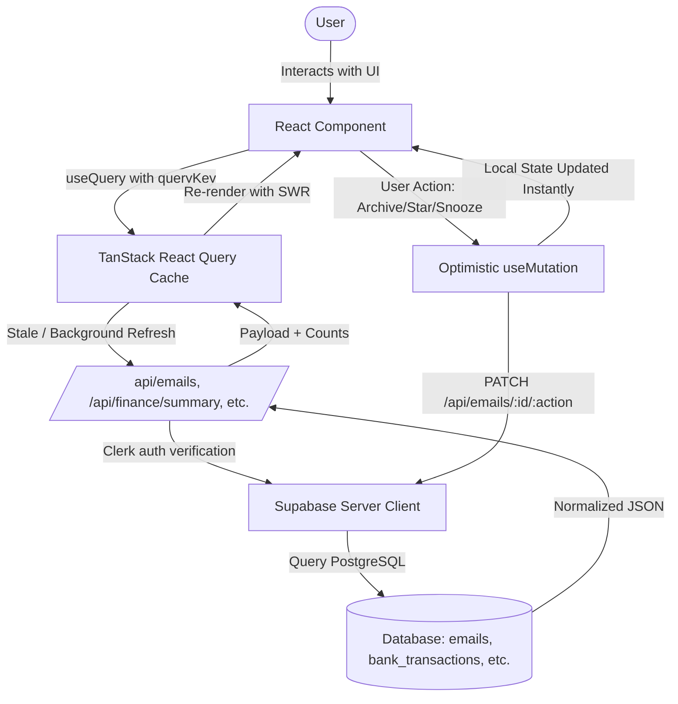

# BriefMail — Complete UI, Design, & System Architecture Guide

> **Current Production Architecture (v2.0)**  
> This document provides an exhaustive, practical breakdown of the visual design system, navigation sitemap, component hierarchy, client-side data pipelines, and responsive desktop/mobile execution across the BriefMail platform.

---

## 1. Design System & Visual Tokens

BriefMail follows a **dark-mode-first, high-density, spatial glassmorphism** aesthetic tailored for high-speed email triage and automated task execution.

### 1.1 Color Architecture & Contrast Compliance
The application uses tailored HSL and hex tokens verified against WCAG AA/AAA guidelines:

| Token Key | Value / Tailwind Class | Application Target | Contrast vs Surface (`#0F172A`) |
| :--- | :--- | :--- | :--- |
| `brand.DEFAULT` | `#FF6B00` (`text-brand`, `bg-brand`) | High-priority CTAs, active indicators, brand logo | `3.8:1` (Large UI / Bold) |
| `brand.hover` | `#FF8933` (`bg-brand-hover`) | Button hover states, interactive controls | `5.2:1` (Pass AA) |
| `brand.subtle` | `rgba(255, 107, 0, 0.12)` (`bg-brand-subtle`) | Active tab pill backgrounds, glow backdrops | Non-text decorative fill |
| `brand.glow` | `0 0 20px -2px rgba(255, 107, 0, 0.35)` | Accent card and icon glow effects | Decorative shadow |
| `surface.base` | `#0B1120` (`bg-surface-base`) | Main viewport canvas, outer screen backdrop | Base canvas |
| `surface.DEFAULT` | `#0F172A` (`bg-surface`) | Sidebar, reading pane, modals, list cards | Elevation 1 |
| `surface.elevated` | `#1E293B` (`bg-surface-elevated`) | Dropdowns, popovers, active card borders | Elevation 2 |
| `surface.overlay` | `#334155` (`bg-surface-overlay`) | Hovered table rows, snooze pickers | Elevation 3 |
| `border.subtle` | `rgba(248, 250, 252, 0.08)` | Hairline pane dividers, inactive card borders | Subtle border separation |
| `border.strong` | `rgba(248, 250, 252, 0.16)` | Card hover boundaries, active focus rings | Crisp edge definition |
| `text.primary` | `#F8FAFC` (`text-text-primary`) | Email subject lines, headings, action titles | `15.8:1` (Pass AAA) |
| `text.secondary` | `#CBD5E1` (`text-text-secondary`) | Email body previews, descriptions, inputs | `11.1:1` (Pass AAA) |
| `text.muted` | `#94A3B8` (`text-text-muted`) | Timestamps, secondary sender metadata | `6.7:1` (Pass AAA) |
| `text.disabled` | `#475569` (`text-text-disabled`) | Form placeholders, inactive pagination icons | Text fallback |

### 1.2 Category Badge Tokens
Every classified category has a dedicated semantic badge with high-contrast text and glowing border accents:

```typescript
export const CATEGORY_COLORS: Record<string, string> = {
  finance: "bg-emerald-500/20 text-emerald-400 border-emerald-500/30",
  finance_transaction: "bg-emerald-500/20 text-emerald-400 border-emerald-500/30",
  investments: "bg-blue-500/20 text-blue-400 border-blue-500/30",
  jobs: "bg-violet-500/20 text-violet-400 border-violet-500/30",
  career: "bg-purple-500/20 text-purple-400 border-purple-500/30",
  meetings: "bg-amber-500/20 text-amber-400 border-amber-500/30",
  ads: "bg-rose-500/20 text-rose-400 border-rose-500/30",
  social: "bg-cyan-500/20 text-cyan-400 border-cyan-500/30",
  newsletter: "bg-teal-500/20 text-teal-400 border-teal-500/30",
  otp: "bg-orange-500/20 text-orange-300 border-orange-500/30",
  system: "bg-slate-500/20 text-slate-400 border-slate-500/30",
  misc: "bg-gray-500/20 text-gray-400 border-gray-500/30",
};
```

### 1.3 Typography Hierarchy
Defined via CSS variables in `src/app/globals.css` and mapped in `tailwind.config.ts`:
* **`font-ui` (`Plus Jakarta Sans`)**: Applied across headings, buttons, tab titles, badges, and navigation labels.
* **`font-body` (`Satoshi`)**: Applied across long-form email reading panes and preview descriptions.
* **`font-mono` (`JetBrains Mono`)**: Applied to dates, timestamps, monetary amounts, OTP codes, and unread counters.

---

## 2. Navigation Sitemap & Route Architecture

The site uses the Next.js App Router grouped under an authenticated `(dashboard)` layout shell:

```
src/app/
├── (dashboard)/               # Authenticated Main Workspace Layout
│   ├── layout.tsx             # Shell: Sidebar (Desktop) + Header + BottomNav (Mobile)
│   ├── inbox/page.tsx         # Primary Inbox feed with animated CategoryTabs
│   ├── all-mail/page.tsx      # Unified stream with Sort Bar, Filter Panel, & Active Chips
│   ├── finance/page.tsx       # Financial Cockpit (Overview, EMIs, SIPs, Transactions)
│   ├── career/page.tsx        # Career Pipeline (Kanban board: Applied → Offer)
│   ├── meetings/page.tsx      # Agenda feed & 1-click video join links (Meet, Zoom, Teams)
│   ├── system/page.tsx        # System Triage, Action Items, & Live OTP Copier
│   ├── starred/page.tsx       # Starred priority messages
│   ├── snoozed/page.tsx       # Snoozed email stream with schedule timers
│   └── settings/page.tsx      # Multi-account Gmail OAuth, Sync controls, & Queue Drainer
├── api/                       # Backend REST endpoints
│   ├── emails/                # Paginated email querying, filtering, full email detail
│   ├── finance/summary/       # Financial aggregation endpoint
│   ├── career/applications/   # Job tracker stages & offer letters
│   ├── system/actions/        # Actionable system blocks (OTPs, form links, approvals)
│   └── settings/gmail-accounts# Connected Gmail account credentials & watch status
```

---

## 3. Practical Layout & Component Architecture

### 3.1 Global Shell (`src/app/(dashboard)/layout.tsx`)
The root layout orchestrates navigation based on screen size:
1. **Desktop (≥ 1024px / `lg:block`)**:
   * Fixed 240px wide **`Sidebar.tsx`** on the left.
   * Sticky 56px top header with view title, glowing `AI Sync Active` pulsing dot, and search.
   * `main` scroll container fills the remaining viewport.
2. **Mobile (< 1024px / `lg:hidden`)**:
   * Sidebar is hidden to maximize reading area.
   * Sticky top header displays title + Clerk user profile trigger.
   * Fixed 60px **`BottomNav.tsx`** anchored to the bottom.
   * Main scroll area has `pb-20` padding so content is never blocked by the bottom navigation bar.

### 3.2 Component Directory Mapping
* **`src/components/ui/`**:
  * `Sidebar.tsx`: Fixed desktop navigation with brand logo, main views, colored category shortcuts, connected account statuses, and settings link. Uses GSAP for entrance stagger animations.
  * `BottomNav.tsx`: Touch-friendly mobile bottom bar with 8 key destinations, tap haptic feedback (`navigator.vibrate(100)`), Framer Motion active dot indicator, and iOS safe-area inset support (`env(safe-area-inset-bottom)`).
  * `CategoryTabs.tsx`: Horizontally scrollable pill tabs for switching categories (`All`, `Finance`, `Jobs`, `Career`, etc.) with Framer Motion `layoutId="activeCategoryPill"` sliding background transitions.
* **`src/components/email/`**:
  * `EmailListItem.tsx`: High-density email card. Shows unread dot indicator, sender avatar initial, category badge, subject, snippet, and relative timestamp. Supports swipe-to-archive (swipe right) and swipe-to-star (swipe left).
  * `EmailDetail.tsx`: Comprehensive email reader. Contains action buttons (Archive, Snooze picker, Star), AI summary callout box, action item checklist, and sanitized HTML email body. Outgoing links are processed with `addTargetBlank()` to open in new tabs.
* **`src/components/system/`**:
  * `ActionBlockGrid.tsx`: Live cards for urgent notifications. Features auto-extracted 4–8 digit OTP codes with single-click copy buttons and visual countdown timers.
  * `SystemBundle.tsx`: Clustered grouping of noisy platform alerts (GitHub, AWS, CI/CD) with a bulk "Mark All as Read" action.
* **`src/components/finance/`**:
  * `OverviewCards.tsx`: Monthly debits vs. credits and next EMI due date.
  * `EMITimeline.tsx`: Loan liability cards with principal/interest amortization schedules.
  * `SIPDashboard.tsx`: Mutual fund investments, current NAV, and portfolio returns.
  * `TransactionList.tsx`: Individual debits/credits with payment modes (`UPI`, `Card`, `NetBanking`).
* **`src/components/career/`**:
  * `KanbanBoard.tsx`: 4-column drag/drop recruitment board (`Applied`, `Interviewing`, `Offered`, `Rejected`).
  * `CareerStatsBar.tsx`: Funnel conversion rate indicators.
  * `OfferDetailsPanel.tsx`: Extracted CTC (`₹ LPA`), joining dates, and assessment links.

---

## 4. How the UI Gets and Manages Data

BriefMail combines **TanStack React Query (v5)** with **Zustand** and Supabase REST endpoints for instant, optimistic responsiveness:



### 4.1 Query Keys & Stale-Time Strategy
* **Inbox Emails**: `["emails", activeCategory, page, searchQuery]` (staleTime: `30s`, refetchInterval: `30s`).
* **All Mail Stream**: `["emails-all-mail", page, searchQuery, sortBy, sortOrder, categories, status, dateFrom, dateTo, accountId]` (staleTime: `30s`).
* **Single Email Detail**: `["email-detail", selectedEmailId]` (staleTime: `60s`).
* **Connected Gmail Accounts**: `["gmail-accounts-list"]` (staleTime: `5m`).
* **Finance Summary**: `["finance-summary"]` (staleTime: `5m`).

### 4.2 Optimistic UI Updates
When a user archives, stars, or snoozes an email:
1. The component immediately modifies `allFetchedEmails` in local state (`setAllFetchedEmails`).
2. If the active email is currently open, it advances to the next or closes smoothly.
3. The mutation runs asynchronously in the background via `fetch('/api/emails/:id/archive', { method: 'PATCH' })`.
4. On success or error, `queryClient.invalidateQueries` synchronizes with server state.

---

## 5. Desktop vs. Mobile Implementation Matrix

| Interaction | Desktop (≥ 1024px) | Mobile (< 1024px) |
| :--- | :--- | :--- |
| **Layout Layout** | Split-pane (Master-Detail): 420px email list column on left, expansive reading pane on right. | Single-column view. Tapping an email triggers a smooth spring-animated 90vh bottom sheet drawer (`EmailDetail.tsx`). |
| **Primary Nav** | Fixed 240px Left Sidebar with brand header, categorized view shortcuts, and account selectors. | Fixed 60px Bottom Navigation Bar with thumb-friendly icons, unread badges, and active glowing pill indicators. |
| **Touch & Gestures**| Hover-triggered quick actions (Star, Archive, Snooze). Mouse-driven selection. | Framer Motion touch gestures: Swipe right to Archive (blue backdrop reveal), Swipe left to Star (amber backdrop reveal). |
| **Mobile Haptics** | N/A | Tapping navigation tabs triggers `navigator.vibrate(100)` for tactile physical confirmation. |
| **Filter Panel** | Opens as a structured 3-column grid card with category pill matrices above the message stream. | Collapses into a vertical scrollable sheet with touch-friendly form pickers and clear action buttons. |
| **Scroll Padding** | Standard `p-6 pb-6`. | Main content includes `pb-20` to prevent the bottom email item from being obstructed by the fixed bottom bar. |

---

## 6. Page-by-Page Feature Specifications

### 6.1 Inbox (`/inbox`)
* Dynamic header tabs (`CategoryTabs.tsx`) displaying unread counts for all categories.
* Automatic first-email selection on desktop for immediate keyboard/mouse reading.
* Background polling every 30 seconds to fetch newly ingested emails from active background drain jobs.

### 6.2 All Mail (`/all-mail`)
* **Always-Visible Sort Bar**: Quick dropdown supporting *Date (Newest/Oldest)*, *Sender (A-Z)*, and *Subject (A-Z)*.
* **Collapsible Filter Panel**: Multi-parameter filter across date ranges (native pickers + 7/30-day presets), status (`All`, `Unread`, `Read`, `Starred`, `Archived`), connected accounts, and multi-select categories.
* **Dismissible Filter Chips**: Applied filters appear as dismissible tags (e.g. `Category: Finance ×`, `Unread ×`) with a one-click *"Clear all"* shortcut.
* **Link Target Safety**: All email bodies are sanitized and rewritten via `addTargetBlank()` to force external links to open in a new tab with `rel="noopener noreferrer"`.

### 6.3 Finance (`/finance`)
* 5 dedicated tabs: Overview, Transactions, EMI Tracker, Investments, and Subscriptions.
* Displays inflow/outflow metrics, upcoming payment reminders, and mutual fund investment values.

### 6.4 Career (`/career`)
* Visual recruitment funnel with drag-and-drop Kanban stages.
* Tracks company names, interview stages, and extracted compensation packages.

### 6.5 System Triage (`/system`)
* **OTP Quick Copier**: Real-time card extracting numeric login codes with a copy button and expiring progress indicator.
* **Clustered Digest**: Groups high-volume automated platform notices so they never clutter user feeds.

### 6.6 Settings (`/settings`)
* Connected Gmail mailbox status with live watch expiration tracking.
* On-demand historical email import controls with custom date bounds.
* Live status monitor for the backend classification queue.